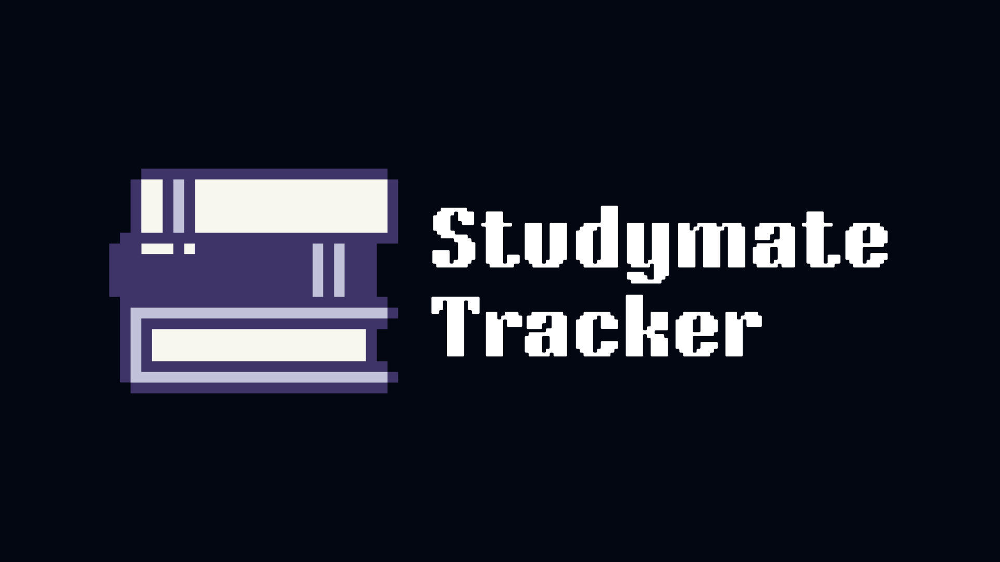

# StudyMate 📚

*A minimal Python study‑time tracker you run from the terminal.*  
Studymate is *your* solution to focussing on your learning.

Log each study session by **subject**, **date**, and **duration** then shows weekly and all‑time summaries.
Use the built-in **timer**, **pomodoro**, or **stopwatch** to focus on your learning.

---

## ✨ Current Features
- Add subjects on the fly  
- Log a session (subject, minutes)
- View a list of all sessions
- View totals of sessions per subject
- Built in timer, stopwatch, and pomodoro to time your sessions (and automatically log them)
- Weekly and monthly stats

## 🛣️ Upcoming Features
- Streaks and goals to improve experience and gamify learning
- Graphs and charts
- App/Website Frontend

---

## 🖥️ Quick Start

```bash
# clone & enter
git clone https://github.com/ItsPixL/studymate-tracker.git
cd studymate‑tracker

# create / activate virtual‑env
python3 -m venv .venv
source .venv/bin/activate   # Windows (WSL) users stay inside WSL

# install deps 
pip install -r requirements.txt 

# run the app! use this command whenever you need to log a session, view stats, or change subject info
python main.py
```

---

## 🤖 A Note on AI Use

AI has been used in this project, but very minimally. ChatGPT was used in creating this README, as well as generating the idea and general development roadmap. However, no AI was used for code or debugging - this was all done manually using documentation and lots of trial and error.

---

## 📃 MIT Licence
Copyright 2025 Neer Sheth

Permission is hereby granted, free of charge, to any person obtaining a copy of this software and associated documentation files (the “Software”), to deal in the Software without restriction, including without limitation the rights to use, copy, modify, merge, publish, distribute, sublicense, and/or sell copies of the Software, and to permit persons to whom the Software is furnished to do so, subject to the following conditions:

The above copyright notice and this permission notice shall be included in all copies or substantial portions of the Software.

THE SOFTWARE IS PROVIDED “AS IS”, WITHOUT WARRANTY OF ANY KIND, EXPRESS OR IMPLIED, INCLUDING BUT NOT LIMITED TO THE WARRANTIES OF MERCHANTABILITY, FITNESS FOR A PARTICULAR PURPOSE AND NONINFRINGEMENT. IN NO EVENT SHALL THE AUTHORS OR COPYRIGHT HOLDERS BE LIABLE FOR ANY CLAIM, DAMAGES OR OTHER LIABILITY, WHETHER IN AN ACTION OF CONTRACT, TORT OR OTHERWISE, ARISING FROM, OUT OF OR IN CONNECTION WITH THE SOFTWARE OR THE USE OR OTHER DEALINGS IN THE SOFTWARE.